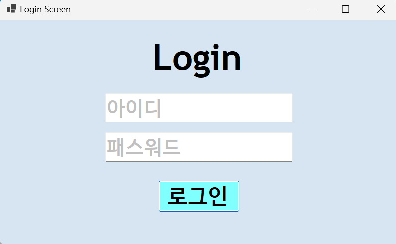
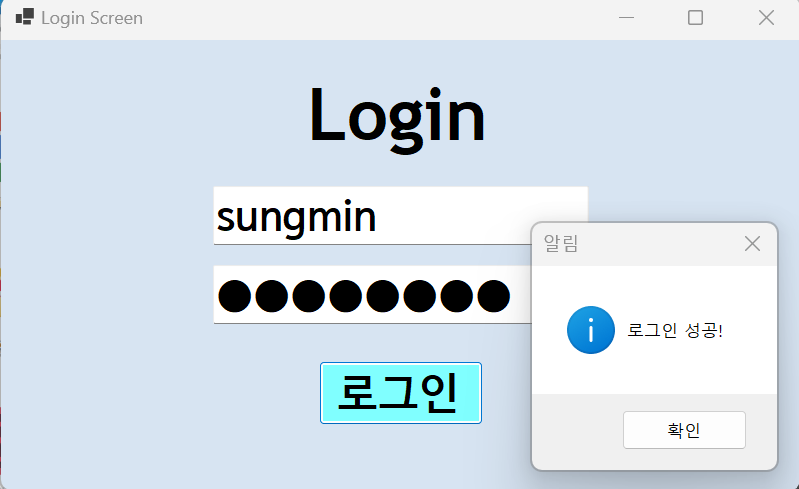
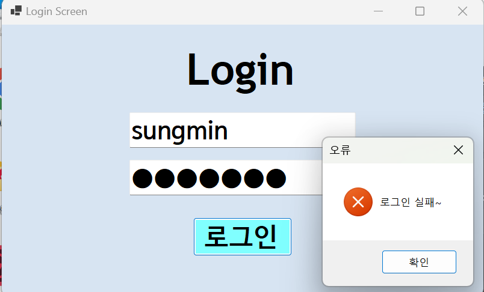
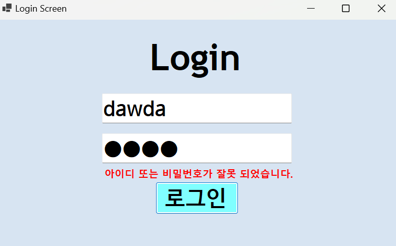
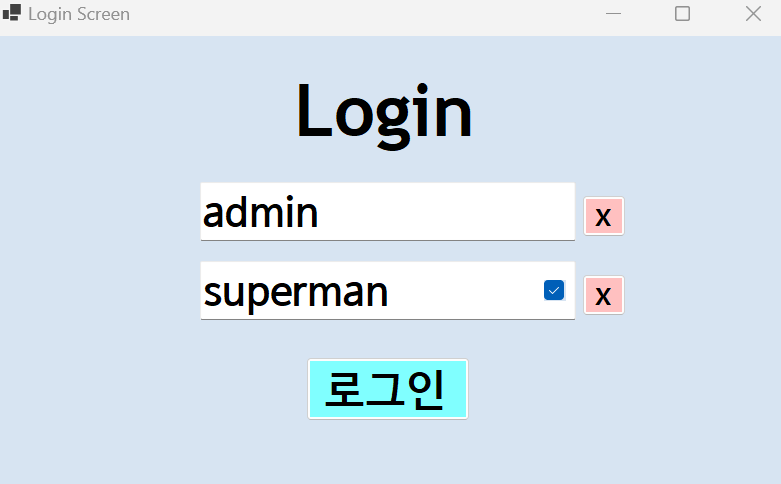
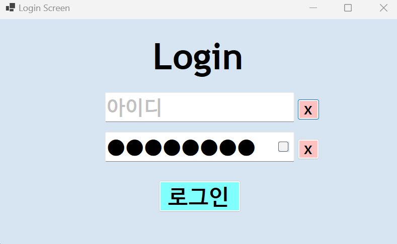

# (C# 코딩) LoginScreen

## 개요
-C# 프로그래밍 

### -1줄소개: 사용자 인증 로직과 Visible 속성을 활용한 상태 피드백 기능을 결합한 로그인 화면 구현

### -사용한플랫폼: C#, .NET Windows Forms, Visual Studio, GitHub

### -사용한컨트롤: Label, TextBox, Button, Checkbox

### -사용한기술과구현한기능: 
 - if ~ else 조건문과 논리 연산자(&&)를 이용한 사용자 인증 로직

 - Enter/Leave 이벤트를 활용한 커스텀 Placeholder(입력 힌트) 기능

 - KeyDown 이벤트를 이용한 Enter 키 포커스 이동 및 버튼 자동 클릭 제어

 - Visible 속성 제어를 통한 실시간 에러 메시지 라벨 표시 및 숨김 기능

 - MessageBox를 활용한 성공 알림 및 MessageBoxIcon 활용

 - 개별 Button 클릭을 통한 입력 필드(TextBox) 초기화 및 힌트 복구 로직

 
### -수업중에배우고사용했던클래스들관련된설명
 
 - MessageBox: 사용자에게 정보를 전달하거나 선택을 요구하는 대화 상자를 생성하는 클래스입니다. Show() 메서드를 통해 텍스트, 캡션, 버튼 종류, 아이콘을 설정할 수 있습니다.

 - Color: 컨트롤의 색상을 지정할 때 사용하며, 실습에서는 힌트 텍스트를 표현하기 위해 Color.Silver와 일반 텍스트인 Color.Black을 사용했습니다.

 - KeyEventArgs: 키보드 입력 이벤트를 처리할 때 사용하는 클래스로, 어떤 키가 눌렸는지(KeyCode) 확인하고 시스템 기본 동작을 제어(SuppressKeyPress)하는 데 활용됩니다.

 - Control.Visible: 컨트롤의 시각적 표시 여부를 결정합니다. 과제 2에서는 에러 라벨(lblErrorMsg)의 노출 여부를 제어하는 데 핵심적으로 사용되었습니다.

 - CheckBox: 사용자의 선택 상태(Checked)를 저장하며, 비밀번호의 보안 마스킹 해제 여부를 결정하는 트리거로 활용되었습니다.

### -실습중에구현한기능들설명

 - Placeholder 처리: 입력창이 비어 있을 때 "아이디", "패스워드"라는 가이드 문구를 표시하여 사용자 편의성을 높였습니다.

 - 개별 입력 삭제: 각 입력창 옆의 삭제 버튼을 클릭하면 Clear() 메서드와 함께 Leave 로직을 강제 호출하여 즉시 힌트 문구가 복구되도록 구현했습니다.

 - 비밀번호 보기 제어: UseSystemPasswordChar 속성을 체크박스 상태와 연동하여 실시간으로 비밀번호 노출 여부를 선택할 수 있게 했습니다.

 - 키보드 인터랙션: 마우스 없이 키보드만으로도 로그인 프로세스(아이디 입력 -> Enter -> 비밀번호 입력 -> Enter -> 로그인)가 완료되도록 흐름을 최적화했습니다.

## 실행화면(과제1)

### -과제1코드의실행스크린샷
 

### -과제내용

1. UI 구성: TextBox(아이디, 패스워드), Button(로그인) 등을 적절히 배치합니다.

2. Placeholder 표시: 아이디와 패스워드 입력 힌트를 회색으로 표시합니다.

3. 로그인 체크 기능: 아이디와 패스워드가 미리 설정된 값과 모두 맞아야 로그인을 허용합니다.

4. 결과 알림: 로그인 성공/실패 시 적절한 메시지 박스를 사용자에게 보여줍니다.

### -구현내용과기능설명
1. 이벤트 기반 텍스트 제어: Enter와 Leave 이벤트를 사용하여 포커스 여부에 따라 힌트 문구를 동적으로 생성/삭제합니다.

2. 비교 연산 로직: if(inputID == myID && inputPW == myPW)를 통해 두 값이 모두 참일 때만 성공 구간을 실행합니다.

3. 비프음 제어: Enter 키 처리 시 SuppressKeyPress = true를 설정하여 윈도우 기본 경고음이 발생하지 않도록 처리했습니다.

4. 패스워드 모드 전환: 힌트 표시 상태(false)와 실제 입력 상태(true)에 따라 비밀번호 마스킹을 유연하게 전환합니다.

### -사용한 기술과 구현한 기능
 - 조건문 활용: if~else 문법을 통한 프로그램의 판단 로직 구현

 - 이벤트 핸들링: Click, KeyDown, Enter, Leave 등 다양한 사용자 인터랙션 처리 기술

 - 포커스 제어: Focus() 메서드를 활용한 입력 순서 최적화 기술

## -실행화면(과제2)
### -과제2코드의실행스크린샷

### -과제내용

1. 에러 표시 방식 변경: 기존의 팝업 메시지 박스 방식에서 UI 내 라벨 표시 방식으로 변경합니다.

2. 컨트롤 숨기기/보이기: Visible 속성을 사용하여 상황에 맞는 화면 제어를 실습합니다.

3. 사용자 경험(UX) 개선: 오류 발생 시 사용자가 확인 버튼을 누르는 번거로움을 줄입니다.

4. 상태 초기화: 로그인 성공 시에는 남아있던 에러 메시지를 다시 숨깁니다.

### -구현내용과기능설명

1. 에러 라벨(lblErrorMsg) 배치: 폼 디자인 시 빨간색 글씨의 라벨을 배치하고 초기 Visible 속성을 false로 설정했습니다.

2. 실패 로직 처리: else 구문 내에서 lblErrorMsg.Visible = true; 코드를 실행하여 사용자에게 즉각적인 시각적 피드백을 줍니다.

3. 성공 로직 처리: 로그인 성공 시 Visible = false;를 통해 화면을 깨끗하게 정리하고 MessageBox로 성공을 알립니다.

4. Placeholder 유지: 과제 1에서 구현한 Enter/Leave 기반의 힌트 기능을 그대로 유지하여 완성도를 높였습니다.
 
### -사용한 기술과 구현한 기능

 - Visible 속성 제어: 컨트롤의 노출 상태를 논리적으로 제어하는 기술

 - UI 상태 관리: 프로그램의 진행 상황(성공/실패)에 따라 컨트롤의 속성을 동적으로 변경

 - 이벤트 핸들링: 버튼 클릭 및 키보드 입력에 따른 조건별 결과 도출 기술

## -실행화면(과제3)
### -과제3코드의실행스크린샷

### -과제내용

1. 개별 필드 삭제 기능: 아이디와 비밀번호 입력창을 각각 독립적으로 초기화할 수 있는 버튼을 추가합니다.

2. 비밀번호 가시성 제어: 체크박스를 통해 입력 중인 비밀번호를 평문으로 보거나 숨길 수 있는 기능을 추가합니다.

3. 이벤트 강제 호출 활용: 삭제 후 힌트 문구를 즉시 띄우기 위해 기존 이벤트 함수를 재사용하는 방법을 실습합니다.

4. 사용자 편의성(UX) 극대화: 오타 수정 시의 번거로움을 줄이고 입력 내용을 확인할 수 있는 환경을 구축합니다.

### -구현내용과기능설명

1. 필드 초기화 로직: btnCleanID_Click 실행 시 해당 텍스트박스를 비우고, 인위적으로 Leave 이벤트를 발생시켜 힌트 문구를 재표시합니다.

2. 실시간 마스킹 해제: chkPWLook의 체크 상태(!chkPWLook.Checked)를 UseSystemPasswordChar에 직접 대입하여 즉각적인 UI 반영을 구현했습니다.

3. 조건부 보안 처리: txtPW_Enter 시점에 체크박스가 체크되어 있다면 보안 문자가 작동하지 않도록 논리 구조를 보완했습니다.

4. 에러 라벨 연동: 과제 2에서 구현한 에러 라벨 제어 로직을 통합하여 로그인 실패 시의 시각적 알림을 유지했습니다.

### -사용한 기술과 구현한 기능

 - 이벤트 핸들러 수동 호출: null 인자를 활용하여 정의된 이벤트를 코드상에서 직접 실행하는 기술

 - 컨트롤 속성 연동: 체크박스의 bool 상태를 다른 컨트롤의 보안 속성에 매핑하는 인터랙션 기술

 - 상태 보존 로직: 삭제 및 포커스 이동 시에도 Placeholder의 색상과 텍스트 상태가 깨지지 않도록 하는 예외 처리 기술